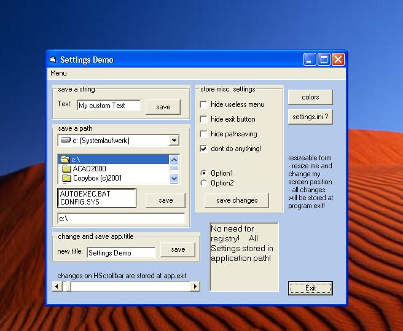

<div align="center">

## save\-get settings from textfile\-demo


</div>

### Description

Teaches how to store custom settings in your application to a textfile, cause its much easier than the registry.

Store textentries, checkvalues, colors, filepaths and more. See Screenshot! Its easy and every beginner should know about "writeprofilestring".
 
### More Info
 


<span>             |<span>
---                |---
**Submitted On**   |2002-07-11 13:41:34
**By**             |[Ranma Saotome](https://github.com/Planet-Source-Code/PSCIndex/blob/master/ByAuthor/ranma-saotome.md)
**Level**          |Beginner
**User Rating**    |5.0 (30 globes from 6 users)
**Compatibility**  |VB 5\.0, VB 6\.0
**Category**       |[Files/ File Controls/ Input/ Output](https://github.com/Planet-Source-Code/PSCIndex/blob/master/ByCategory/files-file-controls-input-output__1-3.md)
**World**          |[Visual Basic](https://github.com/Planet-Source-Code/PSCIndex/blob/master/ByWorld/visual-basic.md)
**Archive File**   |[save\-get\_s1048747112002\.zip](https://github.com/Planet-Source-Code/ranma-saotome-save-get-settings-from-textfile-demo__1-36801/archive/master.zip)

### API Declarations

```
Public Declare Function GetPrivateProfileString Lib "kernel32" Alias "GetPrivateProfileStringA" (ByVal lpApplicationName As String, ByVal lpKeyName As Any, ByVal lpDefault As String, ByVal lpReturnedString As String, ByVal nSize As Long, ByVal lpFileName As String) As Long
Public Declare Function WritePrivateProfileString Lib "kernel32" Alias "WritePrivateProfileStringA" (ByVal lpApplicationName As String, ByVal lpKeyName As Any, ByVal lpstring As Any, ByVal lpFileName As String) As Long
```


